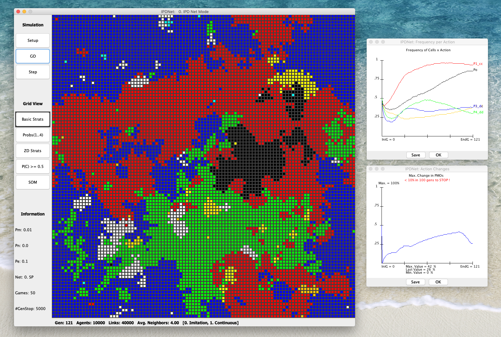

# IPDNet: Iterated Prisoner’s Dilemma over Networks

IPDNet is a free to use open-source Java-based software, developed by [Juan C. Burguillo](https://sites.google.com/site/jcburgui2) to study the iterated prisoner’s dilemma (IPD) over the networks.




## Table of Contents
1. [IPDNet Basic Features](#IPDNet-basic-features)
2. [How to use IPDNet](#how-to-use-IPDNet)
3. [IPDNet Utilities](#IPDNet-Utilities)
4. [Citing](#citing)
5. [License](#licence)


## IPDNet Basic Features

IPDNet works in two modes: i) using a graphical user interface (GUI) for doing micro-simulations or ii) using a batch mode for doing macro-simulations. IPDNet also provides support for:

- Visualizing the whole set of cells and their state on simulations.
- Visualizing the simulation results on real time by means of a set of graphical displays.
- Importing network data to reuse particular network structures to run experiments.
- Exporting network data, to save a particular network structure. The format used for the exported files is compatible with popular network analyzers such as Pajek or Gephi.


## How to use IPDNet

A few steps are described next in order to use, program and understand the framework:

1. **Running IPDNet in standalone version**: just double-click or execute from the shell the IPDNet.jar file provided in the distribution. You must have installed the Java 1.8 version.

2. **Opening IPDNet in Eclipse**: the framework has been programmed in Java using Eclipse, and should be easily open as an Eclipse project. Just decompress the IPDNet.zip file to have a IPDNet folder that you must import as a project from Eclipse.

3. **Documentation**: simply open the “Intro2IPDNet.pdf” file included in the distribution for a brief introduction to IPDNet. Besides, the source files are fully commented.

4. **API**: the document “Intro2IPDNet.pdf”, included in the distribution, contains a short API description. You can also use the IPDNet API.zip file, containing the documentation generated by “javadoc”.


## IPDNet Utilities
IPDNet allows a hands-on approach to simulating the IPD over the nets. Using IPDNet you can:

- **Run Micro-simulations**: most of the simulations can be directly run in a one-shot mode, selecting them directly from the main menu of the simulator. The different game simulation parameters can be reviewed and modified from the experiment option window, or from a general configuration window. No programming skills are needed to run the simulator in this mode.
- **Run Macro-simulations**: having very basic general programming skills allows the reader to configure some batch files to execute a set of experiments, involving multiple runs, to analyze the average results provided by such set of game simulations.
- **Modify the code**: readers having standard Java programming skills can redesign their own algorithms, and then test the behaviors obtained by performing new experiments. For this, new algorithms can be created from scratch, or more commonly, the algorithm files already included can be inherited and used as templates. IPDNet code includes support for generating different types of complex topologies, using several machine learning techniques, performing evolutionary meta-decisions, generating real-time visualizations and interacting with external network analyzers.


## Citing

You may cite this repository in the following way:
```
@misc{Burguillo2022,
  author = {Burguillo, Juan C.},
  title = {IPDNet: Iterated Prisoner’s Dilemma over Networks},
  year = {2022},
  publisher = {GitHub},
  journal = {GitHub repository},
  howpublished = {\url{https://github.com/jcburguillo/IPDNet}},
}
```

## Licence

IPDNet is released under the GNU General Public Licence, version 3 or later.
